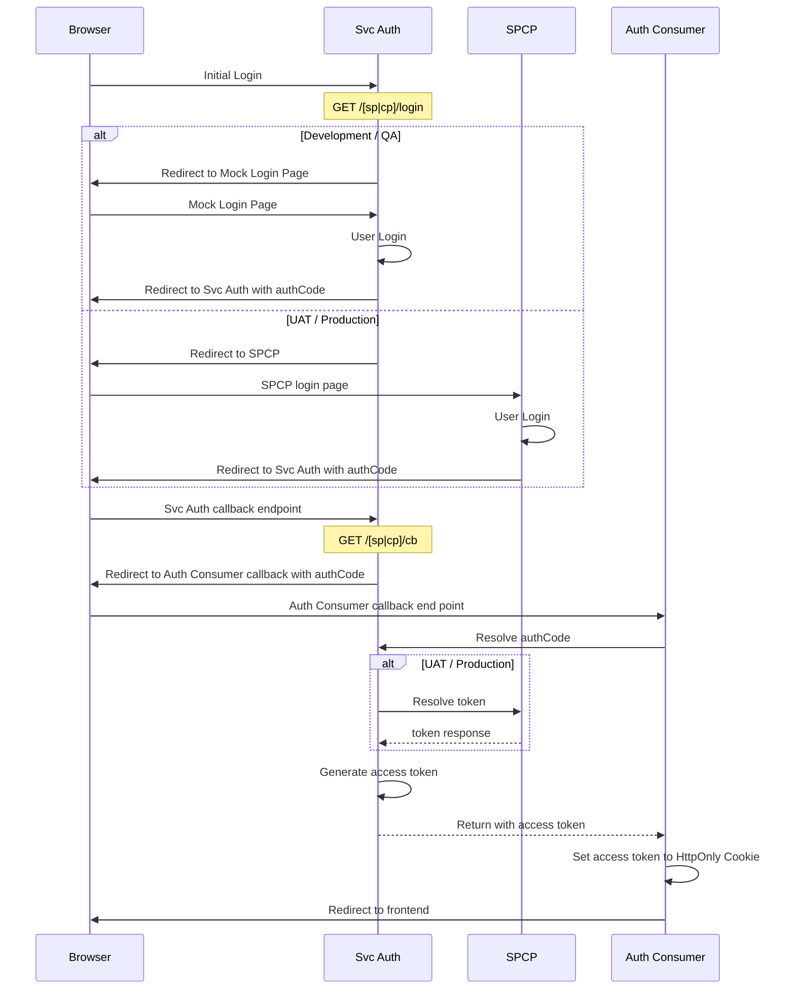
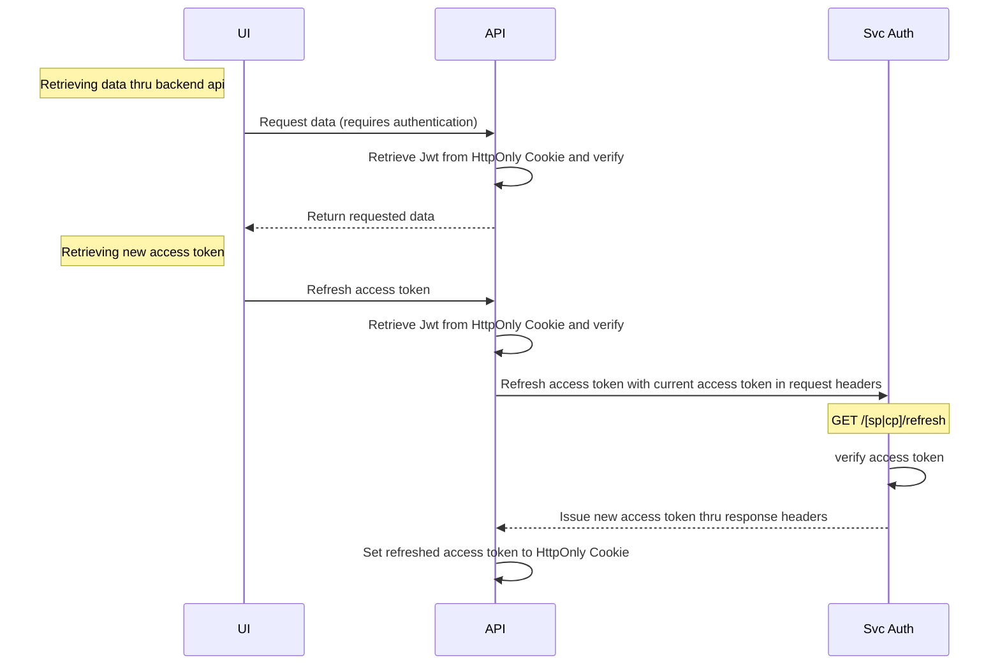

# Authentication with Singpass / Corppass

### Run Locally

```bash
./gradlew bootRun
# default port is set to 8000
```

### Run Test

```bash
./gradlew test
```

### Environment Variables
|                                                                |                                                        |
|----------------------------------------------------------------|--------------------------------------------------------|
| SPRING_PROFILES_ACTIVE                                         | specify which Environment are active.                  |
| **`Jwt Token`**                                                |                                                        |
| APP_TOKEN_SIGNING_JWK                                          | JSON Web Key use to sign/verify the JWT                |
| APP_TOKEN_ENCRYPTION_JWKS_URL                                  | Remote url to get JWKS used to encrypt the content of JWT |
| APP_TOKEN_EXPIRATION_TIME                                      | How many milliseconds will the JWT be valid for        |
| APP_TOKEN_MAX_AGE                                              | How many milliseconds will the JWT be valid for after been issued. Default: 43200000 (12 hours) |
| APP_TOKEN_PLUGIN_JAR_FILE_URL                                  | The URL of the plugin jar file                         |
| APP_TOKEN_PLUGIN_CLASS_PATH                                    | The class path of the plugin class to be instantiated  |
| **`Singpass`**                                                 |                                                        |
| APP_SINGPASS_HOMEPAGE_URL                                      | Homepage of the app using svc-auth for singpass        |
| APP_SINGPASS_SERVICE_PROVIDER_LOGIN_URL                        | Login(callback) url of the app using svc-auth |
| APP_SINGPASS_OPEN_ID_PROVIDER_HOST                             | Singpass url domain                                    |
| APP_SINGPASS_OPEN_ID_PROVIDER_CLIENT_ID                        | Client Id given by Singpass during onboarding          |
| APP_SINGPASS_OPEN_ID_PROVIDER_REDIRECT_URI                     | This is the URI to which the Singpass authCode response should be sent. e.g. https://svc.auth/sp/cb |
| APP_SINGPASS_OPEN_ID_PROVIDER_AUTHORIZE_ENDPOINT               | Endpoint to obtain an authorization code which will be later used to exchange with Singpass to get ID token |
| APP_SINGPASS_OPEN_ID_PROVIDER_TOKEN_ENDPOINT                   | Endpoint to obtain an ID token and access token |
| APP_SINGPASS_OPEN_ID_PROVIDER_AUTHORIZATION_INFO_ENDPOINT      | Endpoint to obtain user's authorization info |
| APP_SINGPASS_OPEN_ID_PROVIDER_LOGOUT_ENDPOINT                  | Endpoint to logout user from NDI's provider |
| APP_SINGPASS_OPEN_ID_PROVIDER_TOKEN_SIGNING_JWK                | JSON Web Key use to sign client assertion (used for identifying us) when exchanging access token |
| APP_SINGPASS_OPEN_ID_PROVIDER_TOKEN_ENCRYPTION_JWK             | JSON Web Key use to decrypt Singpass JWE payload (Singpass will use the public key hosted on /sp/openid/jwks) to encrypt the payload |
| APP_SINGPASS_OPEN_ID_PROVIDER_TOKEN_JWKS_ENDPOINT              | Singpass JSON Web Keys endpoint                        |
| APP_SINGPASS_ADDITIONAL_INFO_REQUEST_URL                       | Url to fetch additional info into the token            |
| APP_SINGPASS_ADDITIONAL_INFO_REQUEST_HTTP_METHOD               | Http method use to fetch the additional info url e.g GET/POST |
| APP_SINGPASS_ADDITIONAL_INFO_REQUEST_BODY                      | Any body to be passed in for fetch additional info     |
| APP_SINGPASS_ADDITIONAL_INFO_REQUEST_STATIC_JSON               | Static JSON payload to be added into token             |
| APP_SINGPASS_ADDITIONAL_INFO_REQUEST_REQUEST_TIMEOUT           | How many milliseconds to wait for the request response before timeout |
| **`Corppass`**                                                 |                                                        |
| APP_CORPPASS_HOMEPAGE_URL                                      | Same as Singpass but for Corppass                      |
| APP_CORPPASS_SERVICE_PROVIDER_LOGIN_URL                        | Same as Singpass but for Corppass                      |
| APP_CORPPASS_OPEN_ID_PROVIDER_HOST                             | Same as Singpass but for Corppass                      |
| APP_CORPPASS_OPEN_ID_PROVIDER_CLIENT_ID                        | Same as Singpass but for Corppass                      |
| APP_CORPPASS_OPEN_ID_PROVIDER_REDIRECT_URI                     | Same as Singpass but for Corppass                      |
| APP_CORPPASS_OPEN_ID_PROVIDER_AUTHORIZE_ENDPOINT               | Same as Singpass but for Corppass                      |
| APP_CORPPASS_OPEN_ID_PROVIDER_TOKEN_ENDPOINT                   | Same as Singpass but for Corppass                      |
| APP_CORPPASS_OPEN_ID_PROVIDER_AUTHORIZATION_INFO_ENDPOINT      | Same as Singpass but for Corppass                      |
| APP_CORPPASS_OPEN_ID_PROVIDER_LOGOUT_ENDPOINT                  | Same as Singpass but for Corppass                      |
| APP_CORPPASS_OPEN_ID_PROVIDER_TOKEN_SIGNING_JWK                | Same as Singpass but for Corppass                      |
| APP_CORPPASS_OPEN_ID_PROVIDER_TOKEN_ENCRYPTION_JWK             | Same as Singpass but for Corppass                      |
| APP_CORPPASS_OPEN_ID_PROVIDER_TOKEN_JWKS_ENDPOINT              | Same as Singpass but for Corppass                      |
| APP_CORPPASS_MOCK_USER_LIST_URL                                | Url to get a list of mock corppass users' info (dev, qa only) |
| APP_CORPPASS_ADDITIONAL_INFO_REQUEST_URL                       | Url to fetch additional info into the token            |
| APP_CORPPASS_ADDITIONAL_INFO_REQUEST_HTTP_METHOD               | Http method use to fetch the additional info url e.g GET/POST |
| APP_CORPPASS_ADDITIONAL_INFO_REQUEST_BODY                      | Any body to be passed in for fetch additional info     |
| APP_CORPPASS_ADDITIONAL_INFO_REQUEST_STATIC_JSON               | Static JSON payload to be added into token             |
| APP_CORPPASS_ADDITIONAL_INFO_REQUEST_REQUEST_TIMEOUT           | How many milliseconds to wait for the request response before timeout |
| **`Service`**                                                  |                                                        |
| APP_SERVICE_SERVICES_FOLDER_PATH                               | Url to configuration details of service in yaml file |
| APP_SERVICE_SIGNATURE_LIFETIME_CLOCK_SKEW                      | Allowed time different to validate `nonce` parameter in signature payload |


### Authentication Flow


### Access Token Usage


### Services YAML Configuaration

For each service that need to interface with `SVC-AUTH` for a valid JWT token, create a yaml configuration file in `resources/services` directory
Each file should contain the guid identifier to the service, public key to decode and verify signature sent by the service and the payload to insert into the returned JWT token

```
// Arbitrary identifier to locate yaml configuration file of requesting service
guid: ...
// public rsa key to verify signature sent by requesting service
public-key: ...
// As required by service. Can be anything. The payload will be inserted in the issued JWT as it is
payload:
  // Sample payload content
  userId: api-mailer
  authorization:
    - id: '*'
      scopes:
        - jobalert:read
```


#### `How to convert RSA private key to pcks8 format`
```bash
openssl pkcs8 -topk8 -inform PEM -in private_key.pem -out private_key_pkcs8.pem -nocrypt
```

#### `Creating new asymmetric key pairs for new services`
Generate private key:
```bash
  openssl genpkey -algorithm RSA -out private_key.pem -pkeyopt rsa_keygen_bits:512
```
Generate public key using the private key:
```bash
  openssl rsa -pubout -in private_key.pem -out public_key.pem
```

### Operating This

#### Monitoring & Metrics

The Springboot Actuator is used to provide the `/actuator/health` and `/actuator/prometheus` endpoints for healthckeck and Prometheus metrics respectively.

Configuration of both endpoints **require both enabling and exposing** and this is done via the `management.endpoint.*.enabled` and `management.endpoints.web.exposure.include` configurations in `application.yml`.

> For more information refer to https://docs.spring.io/spring-boot/docs/current/reference/html/production-ready-endpoints.html/
